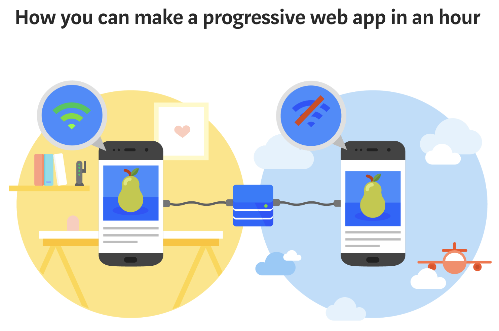
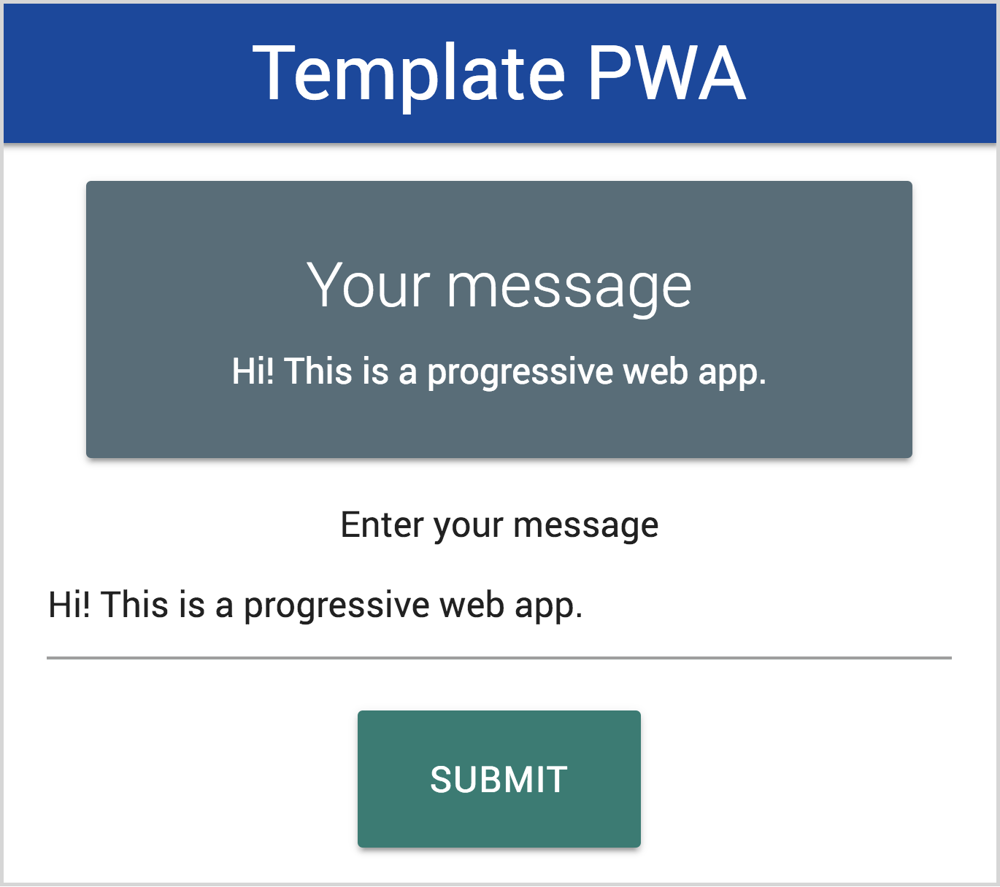

Firebase, Javascript , PWA

# Template Progressive Web App

A template you can use to quickly build a progressive web app that works online, offline, in a browser and as a mobile app.

Read my tutorial on Medium - [How you can make a progressive web app in an hour – freeCodeCamp](https://medium.freecodecamp.org/how-you-can-make-a-progressive-web-app-in-an-hour-7e36d560610e)

[](https://medium.freecodecamp.org/how-you-can-make-a-progressive-web-app-in-an-hour-7e36d560610e)

## Create your app

Clone this repo (or just copy the bits you need). The main files to edit are:  

- [public/index.html](public/index.html) The main page for your app
- [public/style/style.css)](public/style/style.css) Add your own styling to this file
- [public/scripts/app.js](public/scripts/app.js) This contains the javascript to handle the logic in your app. It currently uses localStorage for storing data when the use clicks the button, it is recommended to use another database in production, such as indexedDb (Read more [here](https://developers.google.com/web/fundamentals/codelabs/your-first-pwapp/#intercept_the_network_request_and_cache_the_response))
- [images/icons](images/icons) Create square icons of the number of pixels for each size and save them here
- [public/service-worker.js](public/service-worker.js) Update this with the list of files you want to cache locally



## Using the app

- Open `index.html` within the public folder
- Install a service worker for your browser, if you haven't already (eg [Web Server for Chrome](https://developers.google.com/web/fundamentals/codelabs/your-first-pwapp/#install_and_verify_web_server))
- Browsers may also ask if you want to include the app on your homescreen

## What's included

```
├── README.md
├── firebase.json
└── public
    ├── fonts
    │   └── roboto
    │       └── ...
    ├── images
    │   └── icons
    │       └── ...
    ├── index.html
    ├── manifest.json
    ├── scripts
    │   ├── app.js
    │   ├── jquery-3.3.1.js
    │   └── materialize.js
    ├── service-worker.js
    └── styles
        ├── materialize.css
        └── style.css
```

- [JQuery](https://jquery.com/) A library for supporting quick and easy javascipt in your website
- For styling, this has materialize.js and css from [materializecss.com](http://materializecss.com/). Remove or replace it if you prefer something different.
- [public/service-worker.js](public/service-worker.js) Currently this will cache the app's files for quick local access. Read more about Service Workers [here](https://developers.google.com/web/fundamentals/primers/service-workers/).
- [public/manifest.json](public/manifest.json) A JSON file specifies how your app appears to the user in the areas that they would expect to see apps (for example the mobile home screen), direct what the user can launch and more importantly how they can launch it. Read more about this [here](https://developers.google.com/web/fundamentals/codelabs/your-first-pwapp/#support_native_integration).

## Hosting

- Sign up to firebase  
- Download and install the firebase CLI tools  
- Within your project folder:
  - `firebase init`
  - `firebase deploy`

[More instructions for deploying to firebase](https://developers.google.com/web/fundamentals/codelabs/your-first-pwapp/#deploy_to_firebase)

## Examples

Here is an example I have made, hosted on firebase:
- [ryanwhocodes/qr-code-pwa](https://github.com/ryanwhocodes/qr-code-pwa)
- [qr-code-pwa.firebaseapp.com/](https://qr-code-pwa.firebaseapp.com/)

## Resources

- [Your First Progressive Web App - Google Developers](https://developers.google.com/web/fundamentals/codelabs/your-first-pwapp/)
